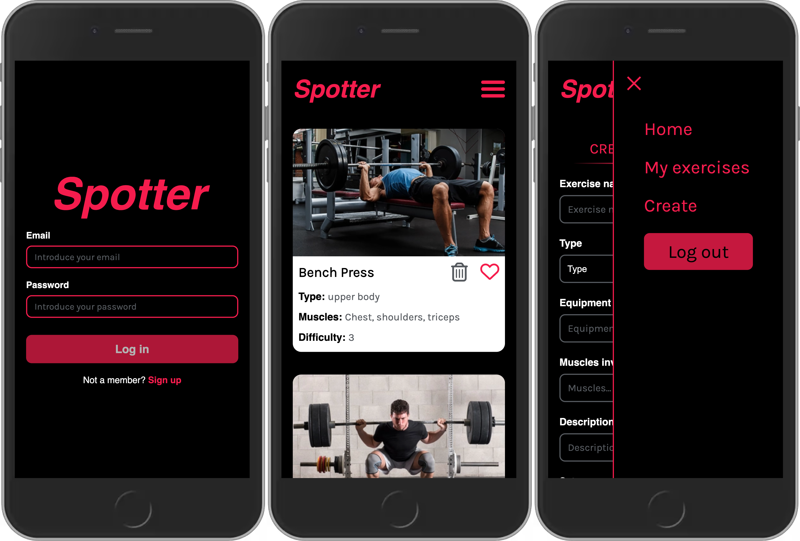
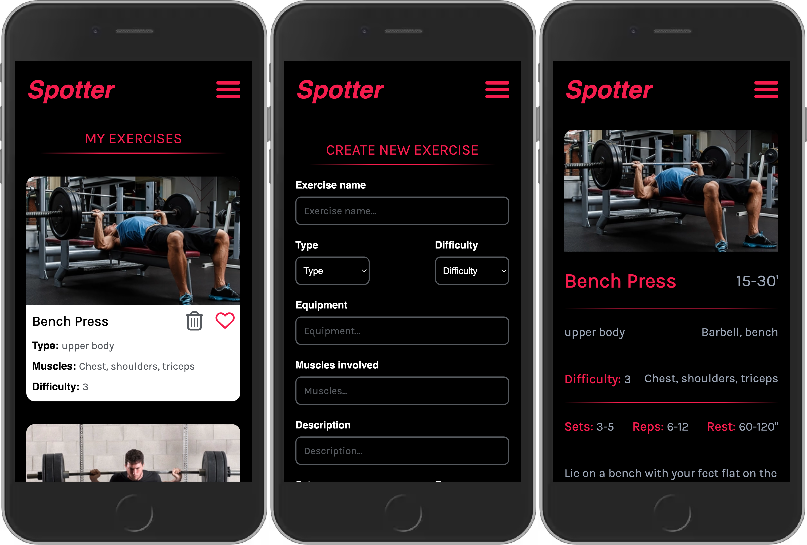

# **Spotter**

Spotter is a website that allows fitness enthusiasts to log in, create, and view exercises. Users can create exercises, add them to their own private list, and view all exercises created by themselves or other users.

[Visit Spotter](https://alex-navarro-final-project-front-2023.netlify.app/)




### **Features**

- Login: Users can log in to the application to access their private exercises.
- Home Page: Displays all exercises created by users, including the user's own exercises.
- My Exercises Page: A private page for each user where they can view and manage their own exercises.
- Create Exercise Page: Users can create new exercises with various specifications such as name, description, and difficulty level.
- Exercise Detail Page: Shows all details of each exercise when the user clicks on an exercise card on the home page.

### **Tech Stack**

- React: a popular frontend library for building web applications
- TypeScript: a strongly typed superset of JavaScript that adds additional features and tooling
- Jest: a popular JavaScript testing framework
- RTL: a React testing library for testing UI components
- Redux Toolkit: a library that simplifies the process of managing state in a React application
- Styled Components: a CSS-in-JS library that allows for easy styling of React components
- Express.js: a Node.js web application framework for building APIs and web applications
- Mongoose: an Object Data Modeling (ODM) library for MongoDB and Node.js
- JWT: JSON Web Tokens for authentication and authorization in web applications
- Supabase: an open source Firebase alternative with real-time capabilities and automatic APIs
- Sharp: a high-performance image processing library for Node.js
- MSW: a library for mocking HTTP requests in browser and Node.js environments for testing purposes.

## **Getting Started**

These instructions will get you a copy of the project up and running on your local machine for development and testing purposes.

Prerequisites: **[Node.js](https://nodejs.org/en/)**

Clone the repository to your local machine:

```
git clone https://github.com/isdi-coders-2023/Alex-Navarro-Final-Project-front-202301-bcn.git
```

```
npm i
```

```
npm start
```

Open **`http://localhost:3000`** in your browser to view the app.

## Possible Implementations

- Exercise Editing
- Workout Creation
- Workout Editing
- Video Upload

## **Author**

Alex Navarro Termens
